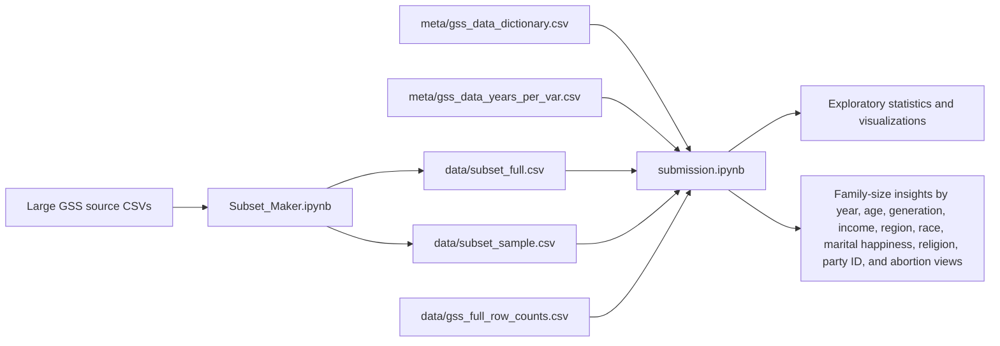

# Decoding Family Size Trends with GSS Data

## Overview

Decoding Family Size Trends with GSS Data is a reproducible exploratory data analysis project built around the General Social Survey (GSS). The project studies how family size, represented by respondents' reported number of children, varies across time and across social, demographic, political, economic, religious, and attitudinal variables.

The repository is designed for readers who want to understand a curated slice of a large public survey dataset without first navigating the full GSS release. It combines a smaller analysis-ready CSV subset, GSS metadata files, and Jupyter notebooks that document the data selection, cleaning, feature engineering, and visual exploration workflow.

At a high level, the workflow is:

1. Select variables from the larger GSS source files.
2. Save a curated subset with variables related to family size and respondent characteristics.
3. Load the subset and supporting metadata into Pandas.
4. Clean categorical survey codes into readable analytical categories.
5. Create derived variables such as generation, age bins, happiness categories, and a summarized abortion-opinion variable.
6. Use grouped aggregation and visualization to explore relationships between number of children and survey variables.

## Features

- Curated GSS subset containing 3,600 respondent rows across 34 survey years from 1972 through 2022.
- Analysis notebook focused on family size trends from 1972 through 2021, excluding incomplete 2022 data in the main analysis.
- Variable selection covering year, age, religion, political party identification, income, region, race, marital happiness, abortion-attitude questions, and number of children.
- Metadata support through a GSS data dictionary and variable-year coverage file.
- Pandas-based data loading, filtering, grouping, aggregation, categorical mapping, and feature engineering.
- Helper functions for reusable grouped averages and derived survey-response classifications.
- Derived `abgen` variable summarizing abortion-opinion responses as `Always legal`, `Sometimes legal`, `Never legal`, or `Unknown`.
- Generational analysis using approximate birth year and Pandas binning.
- Visual analysis with Seaborn and Matplotlib, including line plots, regression scatter plots, bar charts, facet grids, and boxplots.
- Separate subset-building notebook that documents how the local subset CSV files were generated from larger GSS source files.

## Architecture

This is a notebook-driven data analysis repository. It does not contain a web frontend, backend server, database schema, API layer, authentication system, cloud deployment config, CI/CD pipeline, or AI/ML model integration.

| Layer | Implementation | Responsibility |
| --- | --- | --- |
| Data source | External GSS CSV files referenced by the assignment documentation | Original survey data used to create the local subset |
| Data subset | `data/subset_full.csv`, `data/subset_sample.csv` | Analysis-ready 16-variable respondent subset |
| Metadata | `meta/gss_data_dictionary.csv`, `meta/gss_data_years_per_var.csv` | Variable labels, value labels, missing-value codes, and year coverage context |
| Subset generation | `Subset_Maker.ipynb` | Selects the analysis variables from larger local GSS files and writes subset CSVs |
| Analysis workflow | `submission.ipynb` | Loads data, cleans variables, engineers derived fields, aggregates, visualizes, and documents findings |
| Documentation | `README.md`, `data/README.md`, `Project_Planing` | Repository overview, data access note, and project planning notes |

### Workflow Diagram



### APIs, Services, and Infrastructure

No runtime APIs, background jobs, external services, database migrations, authentication providers, or deployment infrastructure are present in this repository. The project runs locally in a Jupyter environment and reads CSV files from the repository plus larger source files that are referenced externally.

## Tech Stack

### Languages

- Python
- Markdown
- CSV
- Jupyter Notebook JSON

### Frontend

- None. The project is presented through Jupyter notebooks rather than a frontend application.

### Backend

- None. There is no server-side application or API backend.

### Database

- None. Data is stored as CSV files and loaded directly with Pandas.

### AI/ML

- None. The repository performs exploratory data analysis and visualization, not machine learning or AI inference.

### Cloud/DevOps

- Git and GitHub repository structure
- No Docker, Railway, Vercel, GitHub Actions, or other deployment configuration is present.

### Testing

- No automated test framework is present.
- Validation is currently performed through notebook execution and visual/data inspection.

### Tools

- Jupyter Notebook
- Pandas
- NumPy
- Seaborn
- Matplotlib

## Repository Structure

```text
.
├── README.md
├── LICENSE
├── Project_Planing
├── Subset_Maker.ipynb
├── submission.ipynb
├── data
│   ├── README.md
│   ├── gss_full_row_counts.csv
│   ├── subset_full.csv
│   └── subset_sample.csv
└── meta
    ├── gss_data_dictionary.csv
    └── gss_data_years_per_var.csv
```

| Path | Purpose |
| --- | --- |
| `submission.ipynb` | Main analysis notebook and narrative data guide. |
| `Subset_Maker.ipynb` | Notebook used to select project variables from larger local GSS CSV files and export subset CSVs. |
| `data/subset_full.csv` | Curated GSS subset used in the main analysis. Contains 3,600 data rows and 16 selected variables, plus the CSV index column. |
| `data/subset_sample.csv` | Sample subset with the same structure as the full subset. In the current repository it has the same row count as `subset_full.csv`. |
| `data/gss_full_row_counts.csv` | Per-year row counts from the full GSS source data for 1972 through 2022. |
| `data/README.md` | Notes where larger source CSV files can be accessed externally. |
| `meta/gss_data_dictionary.csv` | GSS metadata including variable names, labels, value labels, column types, and missing-value codes. |
| `meta/gss_data_years_per_var.csv` | Year-by-variable coverage matrix for the GSS data. |
| `Project_Planing` | Planning notes, project requirements, variables, and team task assignments. |

## Dataset

The local subset includes these analysis variables:

| Variable | Meaning |
| --- | --- |
| `year` | GSS survey year |
| `age` | Respondent age |
| `relig` | Respondent religious preference |
| `partyid` | Political party identification |
| `income` | Total family income code |
| `region` | Region of interview |
| `race` | Respondent race code |
| `hapmar` | Happiness of marriage |
| `abdefect` | Whether abortion should be legal when there is a strong chance of serious fetal defect |
| `abnomore` | Whether abortion should be legal when respondent is married and wants no more children |
| `abhlth` | Whether abortion should be legal when the woman's health is seriously endangered |
| `abpoor` | Whether abortion should be legal when respondent has low income and cannot afford more children |
| `abrape` | Whether abortion should be legal when pregnancy resulted from rape |
| `absingle` | Whether abortion should be legal when respondent is not married |
| `abany` | Whether abortion should be legal if the woman wants it for any reason |
| `childs` | Number of children, with 8 representing 8 or more |

The notebook also creates derived fields during analysis:

- `approx_born`: approximate birth year, calculated as `year - age`.
- `Generation`: generational cohort created with `pd.cut`.
- `num_yes` and `num_no`: counts of affirmative and negative abortion-question responses.
- `abgen`: summarized abortion-opinion category.
- `income_range`: readable income category mapped from `income`.
- `region_name`: readable region category mapped from `region`.
- `happiness_category`: derived marital-happiness category.
- `relig_name` and `party_name`: readable labels for religion and political party codes.

## Setup Instructions

### Prerequisites

- Python 3.x
- Jupyter Notebook or JupyterLab
- Python packages used by the notebooks:
  - `pandas`
  - `numpy`
  - `seaborn`
  - `matplotlib`

No `requirements.txt`, `pyproject.toml`, or environment file is currently committed, so dependencies need to be installed manually.

### Installation

Clone the repository:

```bash
git clone <repository-url>
cd Tabular_Data_Viz
```

Create and activate a local virtual environment:

```bash
python3 -m venv .venv
source .venv/bin/activate
```

Install the notebook dependencies:

```bash
pip install pandas numpy seaborn matplotlib jupyter
```

### Environment Variables

No environment variables are required. The notebooks use local CSV paths and do not read from `.env` files or operating-system environment variables.

### Data Setup

The repository already includes the curated subset files used by `submission.ipynb`:

- `data/subset_full.csv`
- `data/subset_sample.csv`
- `data/gss_full_row_counts.csv`
- `meta/gss_data_dictionary.csv`
- `meta/gss_data_years_per_var.csv`

The original full GSS source CSV files are not committed because they are too large for this repository. `data/README.md` links to the external Google Drive location used by the original assignment.

To regenerate the subset with `Subset_Maker.ipynb`, place the larger source files expected by that notebook in the repository root:

- `gss_sample.csv`
- `GSS_data.csv`

Then run the notebook. It selects the project variables and writes:

- `subset_sample.csv`
- `subset_full.csv`

If you want those regenerated files to match the current repository layout, move or write them under `data/`.

### Local Development

Start Jupyter:

```bash
jupyter notebook
```

Open `submission.ipynb` and run the cells from top to bottom.

### Build Commands

There is no application build step. The primary artifact is the executed notebook.

Optional notebook export:

```bash
jupyter nbconvert --to html submission.ipynb
```

### Deployment

No production deployment configuration is present. The project is intended to be reviewed as a local notebook/data-analysis portfolio project.

## API and Workflow Documentation

There are no API routes or service endpoints. The workflow is notebook-based:

1. `submission.ipynb` loads the curated CSV subset and metadata with `pd.read_csv`.
2. It removes 2022 from the primary analysis because the notebook notes that the year is incomplete.
3. It computes year-level and age-level average number of children with `groupby(...).agg('mean')`.
4. It creates approximate birth years and generational cohorts with `pd.cut`.
5. It uses `.loc` filters to compare age and number of children in selected survey years.
6. It summarizes abortion-attitude variables by counting yes/no answers across seven abortion-related survey questions.
7. It maps income and region codes to readable labels and aggregates average family size by grouped categories.
8. It examines race, marital happiness, religion, and political party identification with grouped means and visualizations.
9. It presents narrative interpretation alongside the code and charts.

## Testing

No automated tests are included. The current validation approach is manual and notebook-driven:

- Confirm CSV files load successfully.
- Execute notebook cells in order.
- Inspect transformed DataFrames with methods such as `head()` and `tail()`.
- Validate grouped outputs and visualizations against the documented narrative.

Recommended lightweight checks for future work include:

- A smoke test that loads every CSV used by the notebook.
- Schema checks for required subset columns.
- A notebook execution check in CI.
- A dependency lock file to make notebook execution reproducible.

## Deployment

No Railway, Vercel, Docker, GitHub Actions, or other deployment infrastructure exists in the repository.

For portfolio review, the most useful presentation formats are:

- The source notebook: `submission.ipynb`
- An exported HTML report generated with `jupyter nbconvert`
- The curated CSV subset under `data/`

## Challenges and Engineering Decisions

- The original GSS source files are too large for the repository, so the project keeps a compact, analysis-focused subset in version control.
- GSS variables use numeric survey codes, requiring careful mapping to readable categories before communication.
- Some variables are not available in every year, so the analysis relies on metadata and explicitly excludes incomplete 2022 data in the main notebook.
- Sensitive variables, especially abortion attitudes and marital happiness, are summarized cautiously and interpreted as exploratory relationships rather than causal claims.
- The project keeps the analysis transparent by preserving notebook code, transformations, plots, and explanatory text together.
- The `abgen` feature reduces multiple related abortion-attitude questions into a single interpretable category while retaining an `Unknown` category for respondents without usable answers.

## Future Improvements

- Add `requirements.txt` or `pyproject.toml` with pinned dependency versions.
- Add a small Python script or Makefile command to regenerate subsets into the `data/` directory reproducibly.
- Standardize the Seaborn import alias throughout the notebook.
- Export and commit an HTML version of the final notebook for easier non-technical review.
- Add automated checks that validate CSV schema, row counts, and notebook execution.
- Add clearer methodology notes about sample weighting and GSS missing-value conventions.
- Create publication-quality chart exports in an `assets/` or `reports/` folder.
- Separate reusable transformation logic into a Python module if the analysis grows beyond a single notebook.

## Screenshots and Demo

No standalone screenshot or demo asset files are currently committed.

Recommended demo materials:

- Export `submission.ipynb` to HTML.
- Add selected chart images from the notebook to an `assets/` folder.
- Link a rendered notebook or HTML report from this section.

## Author

Aniket Gauba

## License

This project is licensed under the MIT License. See `LICENSE` for details.
